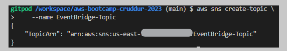

# Week 0 — Billing and Architecture

- The bootcamp had begun with an incredible live stream, through which we had the chance to dive deeper into the details of the new microblogging platform **Cruddur** 

## 1-Conceptual Diagram
 

- [Link to Lucid Chart (page1) ](https://lucid.app/lucidchart/1933f7c7-d92f-4ec1-aa09-46efaf6dc293/edit?invitationId=inv_dbcb3bb6-7080-4744-979e-3d7a8628a021&page=0_0#)

## 2-Logical Diagram 

- [Link to Lucid Chart(page2) ](https://lucid.app/lucidchart/1933f7c7-d92f-4ec1-aa09-46efaf6dc293/edit?invitationId=inv_dbcb3bb6-7080-4744-979e-3d7a8628a021&page=6MaxB44JKEV7#)

## 3-Homework Challenges 

 ### A- Destroying the root account credentials, Set MFA, IAM role 
  

 ### B- Using EventBridge to hookup Health Dashboard to SNS and send notification when there is a service health issue in my case ( when an ec2 instance is terminated)
  #### 1- Creating an SNS Topic 
  
  #### 2- Adding a subscription to the SNS Topic and confirm it 
  
  #### 3- Create an Event Bridge Rule 
   
   
    
  

  #### 4- Testing 
    - I created an EC2 instance and then terminated it, so I immediately received the email 
   
   
 
 ### C- Creating the CI/CD logical pipeline in Lucid Charts 

  
- [Link to Lucid Chart ](https://lucid.app/lucidchart/96438c5f-b9ff-4665-9649-8ae7b929a426/edit?viewport_loc=-105%2C128%2C1613%2C754%2C0_0&invitationId=inv_bd8e93ed-9fd4-40ab-97b4-bad934eb0e0d)
