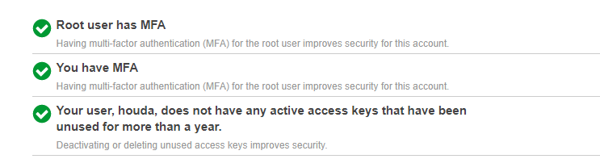

# Week 0 — Billing and Architecture

- The bootcamp had begun with an incredible live stream, through which we had the chance to dive deeper into the details of the new microblogging platform **Cruddur** ! 

## 1-Conceptual Diagram
 

- [Link to Lucid Chart (page1) ](https://lucid.app/lucidchart/1933f7c7-d92f-4ec1-aa09-46efaf6dc293/edit?invitationId=inv_dbcb3bb6-7080-4744-979e-3d7a8628a021&page=0_0#)

## 2-Logical Diagram 

- - [Link to Lucid Chart(page2) ](https://lucid.app/lucidchart/1933f7c7-d92f-4ec1-aa09-46efaf6dc293/edit?invitationId=inv_dbcb3bb6-7080-4744-979e-3d7a8628a021&page=6MaxB44JKEV7#)

## 3-Homework Challenges 

- Destroying the root account credentials, Set MFA, IAM role 
 (./ressources/3.png) (./ressources/2.png)

- Use EventBridge to hookup Health Dashboard to SNS and send notification when there is a service health issue.
  #### 1- Creating an SNS Topic 