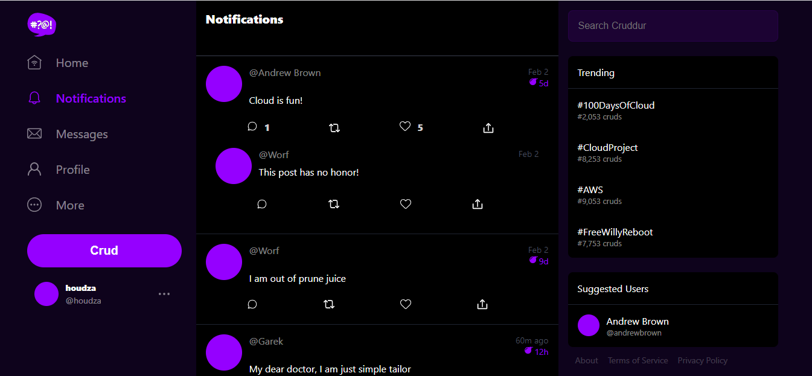
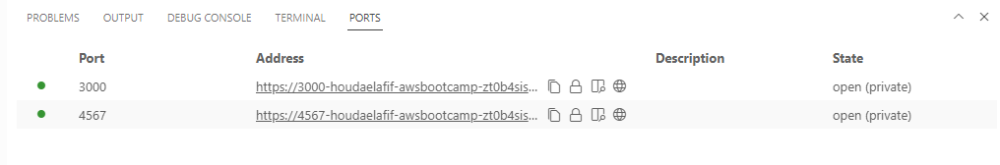
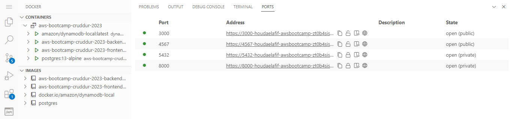
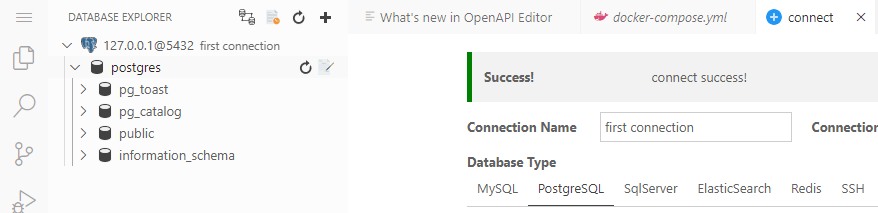
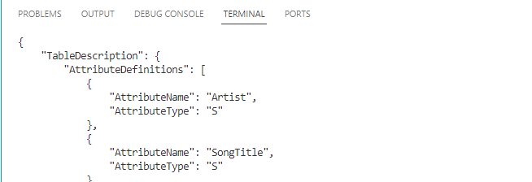
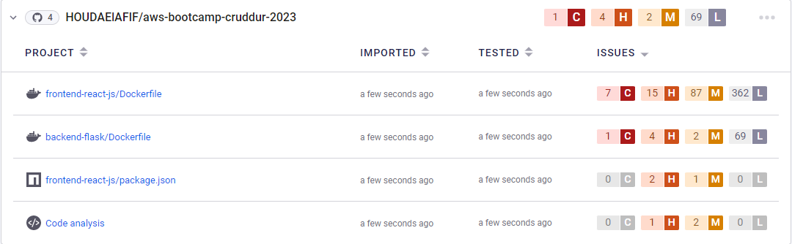
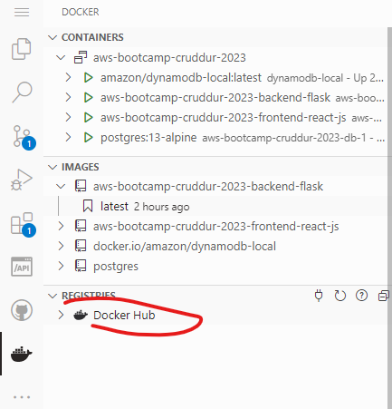
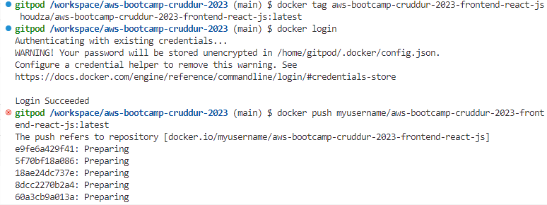
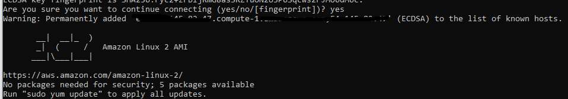
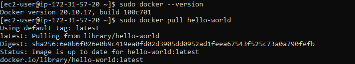

# Week 1 — App Containerization 🚀
## - First we will start by adding the notifications feature to our app 
- adding the notifications's activity the the flask's services 
- adding the notifactions's page in the recat-js frontend 



## - creating dockerfiles for the frontend & backend
[ 👉 frontend's dockerfile  ](../backend-flask/Dockerfile)

[ 👉 backend's dockerfile ](../fronted-react-js/Dockerfile)

## - using Docker Compose to launch our multicontainer APP 
[ 👉 Docker-compose file  ](../docker-compose.yml)

 


## - Extending the docker file to set up DynamoDB local and Postgres

[ 👉 Docker-compose file ](../docker-compose.yml)

 

### - testing Postgres 



### - testing DynamoDB
```
aws dynamodb create-table \
    --table-name Music \
    --attribute-definitions \
        AttributeName=Artist,AttributeType=S \
        AttributeName=SongTitle,AttributeType=S \
    --key-schema \
        AttributeName=Artist,KeyType=HASH \
        AttributeName=SongTitle,KeyType=RANGE \
    --provisioned-throughput \
        ReadCapacityUnits=5,WriteCapacityUnits=5 \
    --table-class STANDARD

```



## - Docker container security  best practices
👉 [Link to the tutorial ](https://www.youtube.com/watch?v=OjZz4D0B-cA&list=PLBfufR7vyJJ7k25byhRXJldB5AiwgNnWv&index=25)
   - image vulnerability scanning
   - use secret management services
   - keep docker & host updated to last security patches 
   - docker deamon and containers should run in a non-user mode

 🚩 **Trying -snyk- for image vulnarebility scanning**

 

# Since we have completed the homework assignments, let's move on to tackling some homework challenges 🏆

## 1- Push and tag a image to DockerHub
-  create a dockerhub account , then -->
 (./ressources/23.png) 



## 2- Launch an EC2 instance that has docker installed 

**after setting up vpc , subnet and security group !**
I launched an ec2 instance and added the following script to the user-data
```
#!#!/bin/bash
sudo yum update -y
sudo amazon-linux-extras install docker
sudo service docker start
sudo systemctl enable docker
sudo usermod -a -G docker ec2-user"

```
### - **trying to connect to the ec2 instance from my local**



### - **Verifying that docker is installed and pulling hello-world image**




## 3- implementing a healthcheck in the Docker compose file

 ⚠️ In production environemenent its possible that we run multiple containers that could crush , sometimes our application crashes but the process itself is still running. In that scenario, we might not know the exact status of the container ! 

  👉 **Configuring  a health check within the composefile on the frontend service to test the backend endpoint**
 

- **test**: This property specifies the command that will be executed and is the health check of the container
- **interval**: This property specifies the number of seconds to initially wait before executing the health check and then the frequency at which subsequent health checks will be performed.
-**timeout**: This property specifies the number of seconds Docker awaits for your health check command to return an exit code before declaring it as failed.
-**retries**: This property specifies the number of consecutive health check failures required to declare the container as unhealthy.

## 4- installing Docker on my local machine and get the app running using wsl on vscode

 
