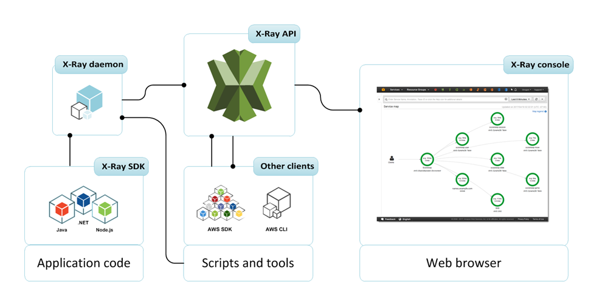
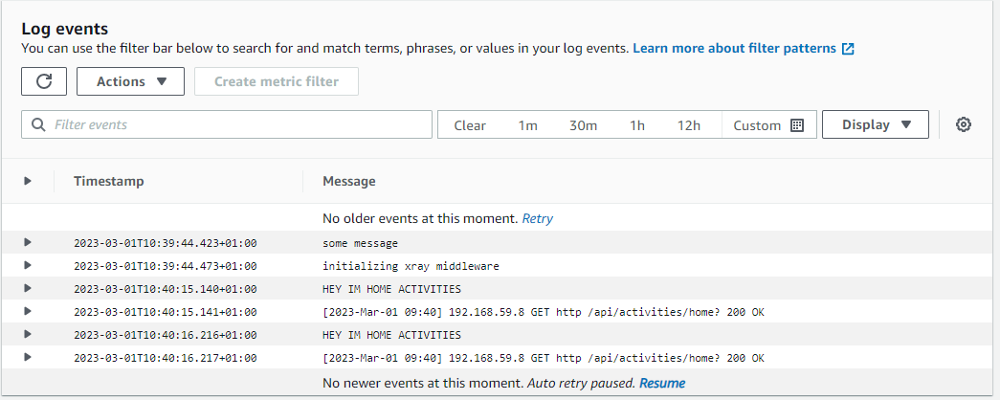
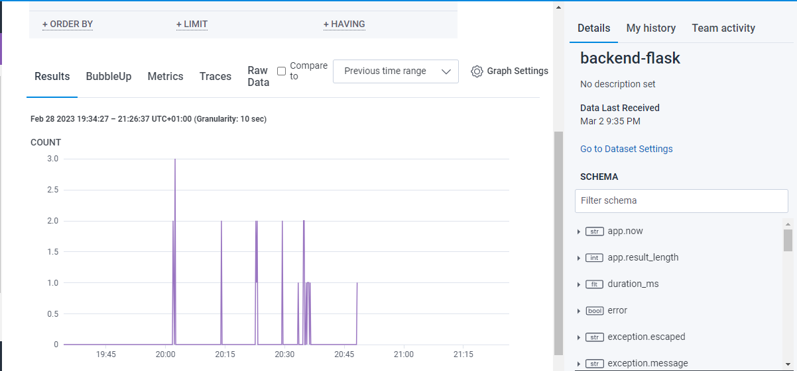

# Week 2 — Distributed Tracing 🔍
## Observability ! 
Nowadays we need better ways of finding problems that happens in our systems that dont necessarely relies on making assumptions about what’s broken before. Making our systems observable enables developers to quickly identify and resolve issues, reducing downtime and improving overall application performance . 

**Obsevability** break down tree key areas : 
      - Tracing 
      - Structured Logs 
      - Metric

### This week focus was on distributed Tracing  🔝

**Distributed Tracing** : is a technique used on software engineering to track the path of a request through a distributed system , allwing developers  to understand how a request flows through multiple services and components , and identify performance  issues and diagnose it

# 1-Instrumenting our backend flask application 

## A- AWS X-RAY  

 👉 X-RAY architecture 

- Add Deamon Service to Docker Compose
 ```
  xray-daemon:
    image: "amazon/aws-xray-daemon"
    environment:
      AWS_ACCESS_KEY_ID: "${AWS_ACCESS_KEY_ID}"
      AWS_SECRET_ACCESS_KEY: "${AWS_SECRET_ACCESS_KEY}"
      AWS_REGION: "us-east-1"
    command:
      - "xray -o -b xray-daemon:2000"
    ports:
      - 2000:2000/udp
 ```
- Create X-Ray group 

     ```aws xray create-group \
   --group-name "Cruddur" \
   --filter-expression "service(\"$FLASK_ADDRESS\") ```
    
- Create sampling rules :   
```
aws xray create-sampling-rule --cli-input-json file://aws/json/xray.json
```



## B- Honeycomb 
#### *Reveals the truth about how your system is behaving on the real world*

When creating a new dataset in Honeycomb it will provide all these installation insturctions

We'll add the following files to  `requirements.txt`

```
opentelemetry-api 
opentelemetry-sdk 
opentelemetry-exporter-otlp-proto-http 
opentelemetry-instrumentation-flask 
opentelemetry-instrumentation-requests
```
Adding to the `app.py`

```py
from opentelemetry import trace
from opentelemetry.instrumentation.flask import FlaskInstrumentor
from opentelemetry.instrumentation.requests import RequestsInstrumentor
from opentelemetry.exporter.otlp.proto.http.trace_exporter import OTLPSpanExporter
from opentelemetry.sdk.trace import TracerProvider
from opentelemetry.sdk.trace.export import BatchSpanProcessor
```

```py
# Initialize tracing and an exporter that can send data to Honeycomb
provider = TracerProvider()
processor = BatchSpanProcessor(OTLPSpanExporter())
provider.add_span_processor(processor)
trace.set_tracer_provider(provider)
tracer = trace.get_tracer(__name__)
```

```py
# Initialize automatic instrumentation with Flask
app = Flask(__name__)
FlaskInstrumentor().instrument_app(app)
RequestsInstrumentor().instrument()
```
Add teh following Env Vars to `backend-flask` in docker compose

```yml
OTEL_EXPORTER_OTLP_ENDPOINT: "https://api.honeycomb.io"
OTEL_EXPORTER_OTLP_HEADERS: "x-honeycomb-team=${HONEYCOMB_API_KEY}"
OTEL_SERVICE_NAME: "${HONEYCOMB_SERVICE_NAME}"
```

```sh
# setting up the env vars 
export HONEYCOMB_API_KEY=""
export HONEYCOMB_SERVICE_NAME="Cruddur"
gp env HONEYCOMB_API_KEY=""
gp env HONEYCOMB_SERVICE_NAME="Cruddur"
```




