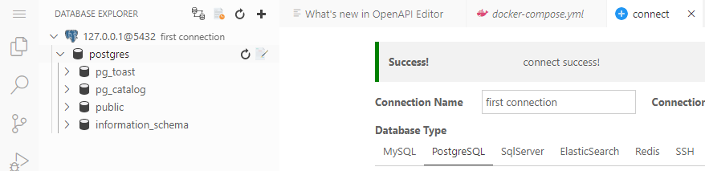

# Week 2 — Distributed Tracing 🔍
## Observability ! 
Nowadays we need better ways of finding problems that happens in our systems that dont necessarely relies on making assumptions about what’s broken before. Making our systems observable enables developers to quickly identify and resolve issues, reducing downtime and improving overall application performance . 

**Obsevability** break down tree key areas : 
      - Tracing 
      - Structured Logs 
      - Metric

### This week focus was on distributed Tracing  🔝

**Distributed Tracing** : is a technique used on software engineering to track the path of a request through a distributed system , allwing developers  to understand how a request flows through multiple services and components , and identify performance  issues and diagnose it

# 1-Instrumenting our backend flask application 

## A- AWS X-RAY  
**a service developed by Amazon that enables developers to conduct performance analysis and debug distributed systems**


 👉 X-RAY architecture 

- Add Deamon Service to Docker Compose
 ```
  xray-daemon:
    image: "amazon/aws-xray-daemon"
    environment:
      AWS_ACCESS_KEY_ID: "${AWS_ACCESS_KEY_ID}"
      AWS_SECRET_ACCESS_KEY: "${AWS_SECRET_ACCESS_KEY}"
      AWS_REGION: "us-east-1"
    command:
      - "xray -o -b xray-daemon:2000"
    ports:
      - 2000:2000/udp
 ```
- Create X-Ray group 

     ```aws xray create-group \
   --group-name "Cruddur" \
   --filter-expression "service(\"$FLASK_ADDRESS\") ```
    
- Create sampling rules :   
```
aws xray create-sampling-rule --cli-input-json file://aws/json/xray.json
```


