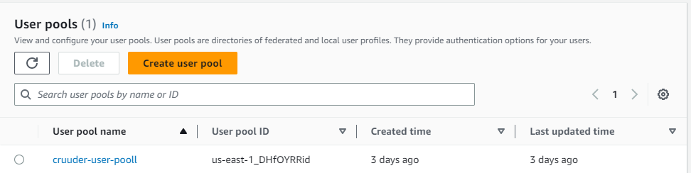
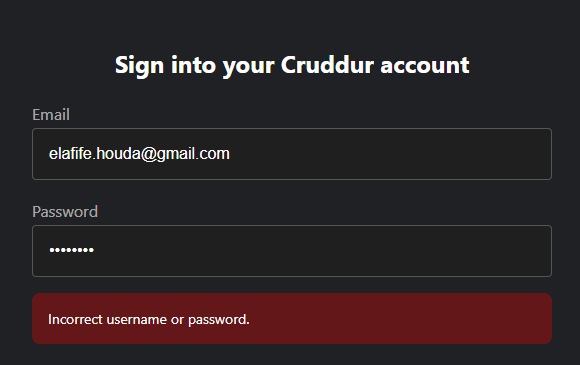
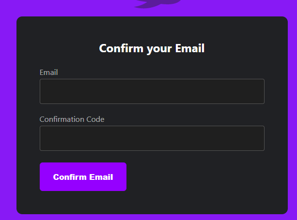
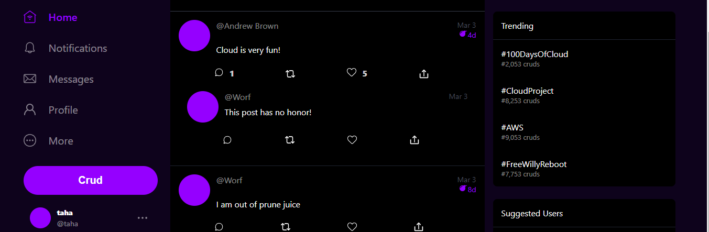
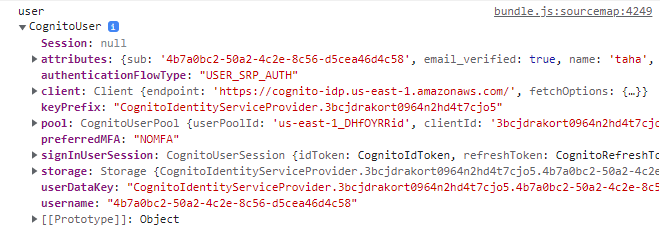
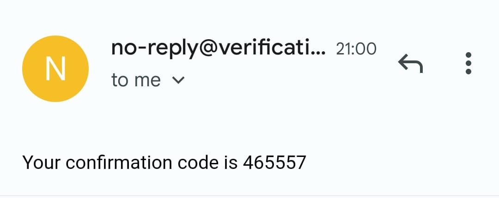
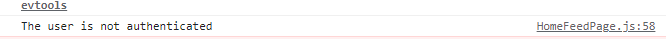

# Week 3 — Decentralized Authentication

##  AWS Cognito 
*a powerful and flexible tool for handling user authentication, authorization, and data management in mobile and web applications.*

**Let's jump to add authentification to the cruddur App** 🚀

## 1- Creating Cognito User Pool using aws console 




## 2- Configure Amplify Client-Side  for Amazon Congito 

```App.js

import { Amplify } from 'aws-amplify';

Amplify.configure({
  "AWS_PROJECT_REGION": process.env.REACT_AWS_PROJECT_REGION,
  "aws_cognito_identity_pool_id": process.env.REACT_APP_AWS_COGNITO_IDENTITY_POOL_ID,
  "aws_cognito_region": process.env.REACT_APP_AWS_COGNITO_REGION,
  "aws_user_pools_id": process.env.REACT_APP_AWS_USER_POOLS_ID,
  "aws_user_pools_web_client_id": process.env.REACT_APP_CLIENT_ID,
  "oauth": {},
  Auth: {
    // We are not using an Identity Pool
    // identityPoolId: process.env.REACT_APP_IDENTITY_POOL_ID, // REQUIRED - Amazon Cognito Identity Pool ID
    region: process.env.REACT_AWS_PROJECT_REGION,           // REQUIRED - Amazon Cognito Region
    userPoolId: process.env.REACT_APP_AWS_USER_POOLS_ID,         // OPTIONAL - Amazon Cognito User Pool ID
    userPoolWebClientId: process.env.REACT_APP_AWS_USER_POOLS_WEB_CLIENT_ID,   // OPTIONAL - Amazon Cognito Web Client ID (26-char alphanumeric string)
  }
});

```

## 3- Config env var on docker-compose "frontend"

```
      REACT_APP_AWS_PROJECT_REGION: "${AWS_DEFAULT_REGION}"
      REACT_APP_AWS_COGNITO_REGION: "${AWS_DEFAULT_REGION}"
      REACT_APP_AWS_USER_POOLS_ID: "us-east-1_DHfOYRRid"
      REACT_APP_CLIENT_ID: "3bcjdrakort0964n2hd4t7cjo5"


```

## 4- Implementing frontend components 
the old implementation was using coockies for authentification , so we update it by configuring jwt token *HomeFeedPage.js, signin.js, signup.js, ProfileInfo.js,DesktopNavigation.js , confirmation.js*








## 5 - Configuring  Amplify server-Side  for Amazon Congito

   ### a- Config env var on docker-compose "backend"

  ```
      AWS_COGNITO_USER_POOL_ID: "us-east-1_DHfOYRRid"
      AWS_COGNITO_USER_POOL_CLIENT_ID:"3bcjdrakort0964n2hd4t7cjo5"

  ```

  ### b- add the cognito library in `requirements.txt`

    ```txt
       Flask-AWSCognito 
    ```

  ### c - add the Authorization header and expose it
```py
cors = CORS(
  app, 
  resources={r"/api/*": {"origins": origins}},
  headers=['Content-Type', 'Authorization'], 
  expose_headers='Authorization',
  methods="OPTIONS,GET,HEAD,POST"
)
```


 ### d- Using this library `Flask-AWSCognito` to handle auth with cognito serverside.
 
   ```py

     # app.py
from lib.cognito_jwt_token import CognitoJwtToken, extract_access_token, TokenVerifyError

# Cognito Auth Serverside init
cognito_jwt_token = CognitoJwtToken(
  user_pool_id=os.getenv("AWS_COGNITO_USER_POOL_ID"), 
  user_pool_client_id=os.getenv("AWS_COGNITO_USER_POOL_CLIENT_ID"),
  region=os.getenv("AWS_DEFAULT_REGION")
)

def data_home():
  access_token = extract_access_token(request.headers)
  try:
    claims = cognito_jwt_token.verify(access_token)
    # authenicatied request
    app.logger.debug("authenicated")
    app.logger.debug(claims)
    # to show who is the signed in user
    app.logger.debug(claims['username'])
    data = HomeActivities.run(cognito_user_id=claims['username'])
  except TokenVerifyError as e:
    # unauthenicatied request
    app.logger.debug(e)
    app.logger.debug("unauthenicated")
    data = HomeActivities.run()
  return data, 200

    

   ```
### e - Removed the access tocken after we sign out by adding this line to `ProfileInfo.js`

```js
    try {
        await Auth.signOut({ global: true });
        window.location.href = "/"
        localStorage.removeItem("access_token")
    }
```





