# Week 5 — DynamoDB and Serverless Caching

## DATA Modelling 

on this Step we've been understanding our data, selecting the appropriate database type, optimizing for access patterns, and leveraging the flexibility and scalability benefits of NoSQL technology

Pattern A: Shows the messages. Users can see the list of the messages that belong to a message group.
Pattern B: Shows the message group conversation with a specific user.
Pattern C: Create a new message in a new message group.
Pattern D: Create a new message in an exisintg group.

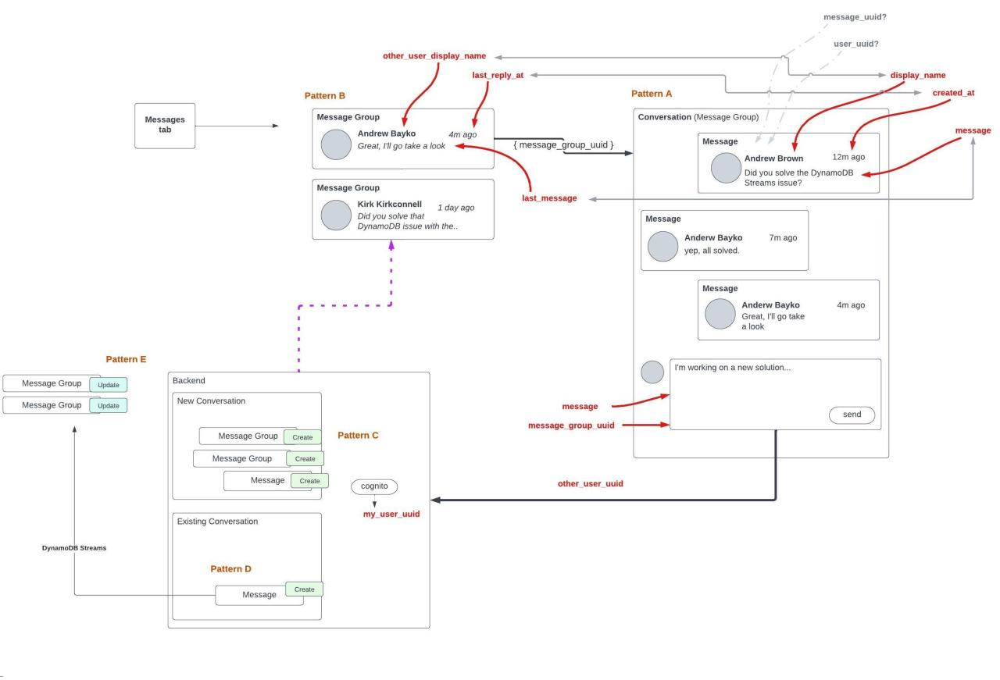

## Implementing scripts for database actions
    - drop 
    - list-tables 
    - scan  
    - schema-load
    - seed

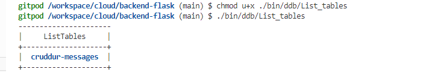

## Implement Pattern Scripts for Read and List Conversations

  - getting the conversation

   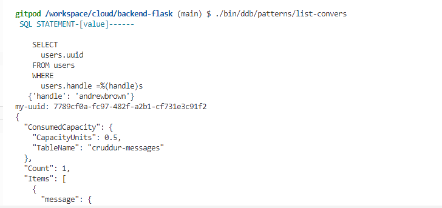

  - Listing conversations

   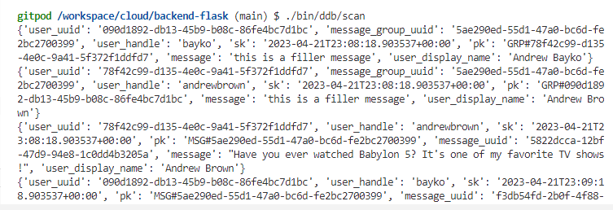

## Implementing the Update of  Cognito ID Script for Postgres Database
 
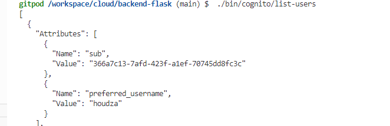

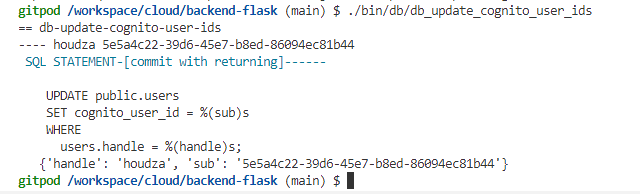

## Implement (Pattern A) Listing Messages in Message Group into Application

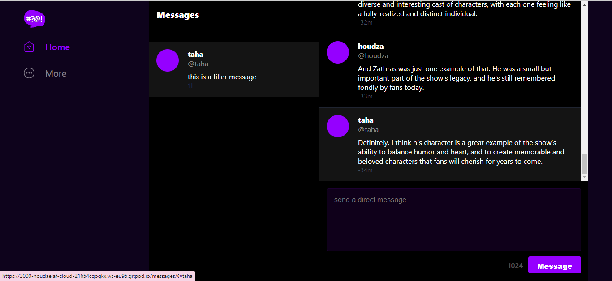

     

## 	Implement (Pattern B) Listing Messages Group into Application
     

## 	Implement (Pattern C) Creating a Message for an existing Message Group into Application

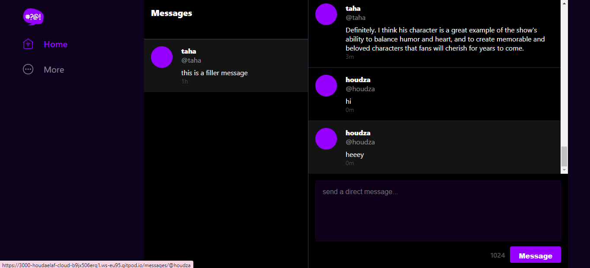

##  Implement (Pattern D) Creating a Message for a new Message Group into Application

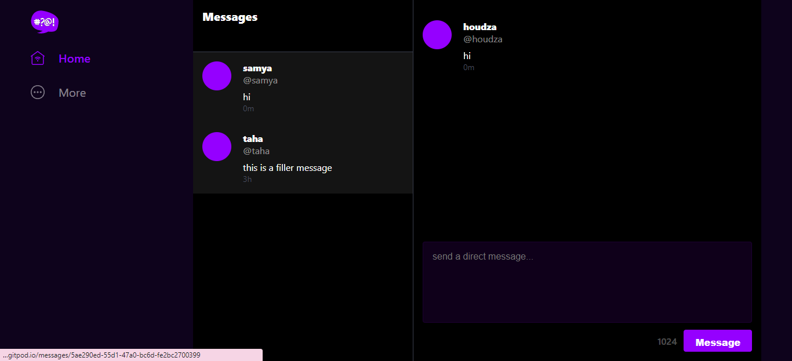

##  Implement (Pattern E) Updating a Message Group using DynamoDB Streams

   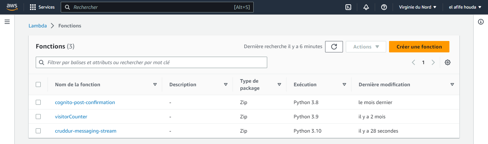

   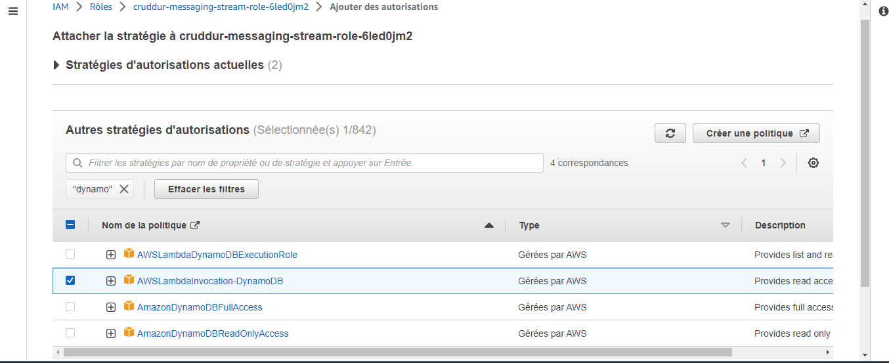

   
   
   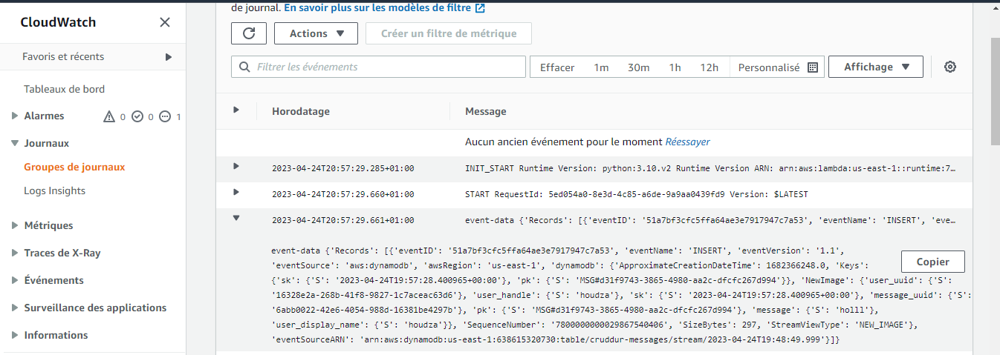