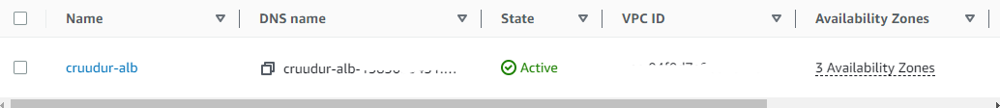

# Week 6-7 — Deploying Containers

## Using AWS CLI, I a ECS cluster named cruddur, and three ECR repos on AWS:

```bash
aws logs create-log-group --log-group-name cruddur
aws logs put-retention-policy --log-group-name cruddur --retention-in-days 1

aws ecs create-cluster \
 --cluster-name cruddur \
 --service-connect-defaults namespace=cruddur

aws ecr create-repository \
 --repository-name cruddur-python \
 --image-tag-mutability MUTABLE

aws ecr create-repository \
 --repository-name backend-flask \
 --image-tag-mutability MUTABLE

aws ecr create-repository \
 --repository-name frontend-react-js \
 --image-tag-mutability MUTABLE

```

## push images for backend-flask and frontend-react-js


## Deploy Frontend React JS  and backend-flask app as a services to Fargate

- registering tasks definition

```
aws ecs register-task-definition --cli-input-json file://aws/task-definitions/backend-flask.json
aws ecs register-task-definition --cli-input-json file://aws/task-definitions/frontend-react-js.json

```

- deploying service 

```
aws ecs create-service --cli-input-json file://aws/json/service-backend-flask.json
aws ecs create-service --cli-input-json file://aws/json/service-frontend-react-js.json
```


## Provision and configure Application Load Balancer along with target groups




## Setup a records set for  to frontend-react-js and backend-flask


## Setup a load balancer listners rules


## My app is available on " houda-techy.link  " 


## Refactoring bin directory to be top level

